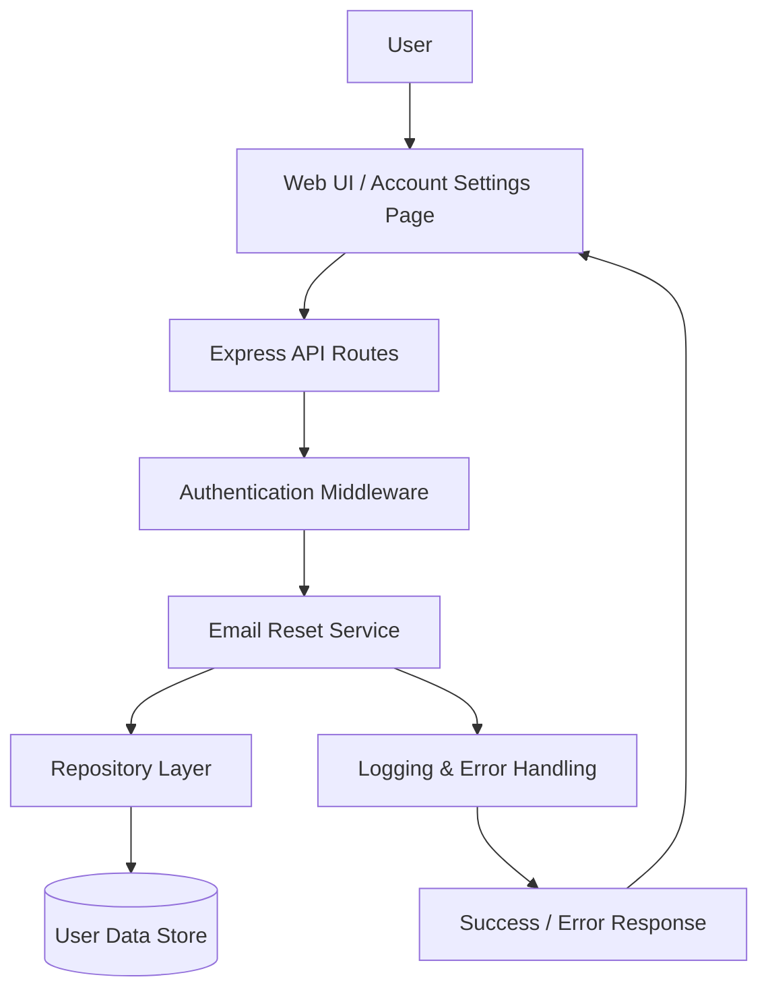

# Architecture Overview

## 1. Recommended Tech Stack

This solution is designed as a modular web application that fits the current project structure while remaining secure, maintainable, and easy to evolve.

### Frontend
- HTML, CSS, and vanilla JavaScript for the current UI experience
- Served from the existing public assets layer
- Lightweight client-side form handling for the email reset experience

### Backend
- Node.js with Express.js as the application server
- Middleware-based request handling for authentication, validation, logging, and error management
- Session-based authentication for the existing web flow

### Security
- bcryptjs for password hashing and verification
- helmet for HTTP security headers
- cors for controlled cross-origin access
- express-session for authenticated user sessions
- server-side password verification only, with no password values logged or exposed in responses
- HTTPS, secure cookies, and request throttling to reduce brute-force and credential abuse risk

### Data Layer
- Current MVP: JSON file-based persistence through a repository abstraction
- Recommended production persistence: PostgreSQL or MySQL with transaction support for atomic user profile updates
- The repository layer remains the abstraction point for future migration to a more durable and concurrent-capable data store

### Testing and Quality
- Jest and Supertest for backend/API testing
- Playwright for end-to-end flow validation

### Production Readiness Enhancements
- Structured logging and monitoring for account update events
- Health checks and backup/restore procedures for the persistence layer
- Multi-instance deployment and load balancing to reduce single-point-of-failure risk

---

## 2. Main Components and Responsibilities

### Client Layer
Responsible for presenting the email reset form and sending requests to the backend.

Responsibilities:
- Capture the current password and new email address
- Validate basic input on the client side for usability
- Display success or error feedback to the user

### API Layer
Responsible for routing incoming requests and enforcing application-level rules.

Responsibilities:
- Expose endpoints such as account/profile update routes
- Authenticate requests before allowing changes
- Parse and forward request data to the service layer
- Return structured responses for success and failure cases

### Authentication and Authorization Middleware
Responsible for protecting sensitive account operations.

Responsibilities:
- Confirm that the request comes from an authenticated user
- Reject unauthenticated requests early
- Ensure that only the logged-in user can update their own email

### Email Reset Service
Responsible for implementing the business rules of the reset email feature.

Responsibilities:
- Validate the provided current password
- Validate the new email format and length
- Check whether the email is already associated with another account
- Apply the email update only if all validations succeed
- Return clear success or error outcomes

### Repository Layer
Responsible for abstracting persistence operations from the application logic.

Responsibilities:
- Read and write user records
- Check for duplicate email values
- Update user profile data safely
- Keep the domain logic independent of storage implementation

### Data Store
Responsible for persistent storage of user account information.

Responsibilities:
- Store user account details including the current email address
- Maintain data consistency during update operations
- Support atomic behavior for update operations

### Logging and Error Handling
Responsible for reliability, observability, and user-friendly failures.

Responsibilities:
- Log requests and important application events
- Capture validation failures and runtime exceptions
- Return appropriate error messages without exposing sensitive internals

---

## 3. Data Flow

1. The user opens the account settings page and submits a request to change their email.
2. The frontend sends the current password and new email address to the backend API.
3. The API layer receives the request and passes it through authentication middleware.
4. The email reset service validates:
   - the user is authenticated
   - the current password is correct
   - the new email is in a valid format
   - the new email is not too long
   - the email is not already in use
5. If validation passes, the repository updates the user’s stored email address.
6. The system returns a success response to the client.
7. If validation fails, the system returns a clear error response without applying any partial update.

### High-Level Request Flow

User -> Frontend -> API Routes -> Auth Middleware -> Email Reset Service -> Repository -> Data Store

---

## 4. Component Diagram

### Notes on the Diagram
- The design follows a layered approach: presentation, API, business logic, persistence.
- The repository layer provides flexibility to switch storage implementations later.
- Security checks are enforced before any update is committed to the data store.
